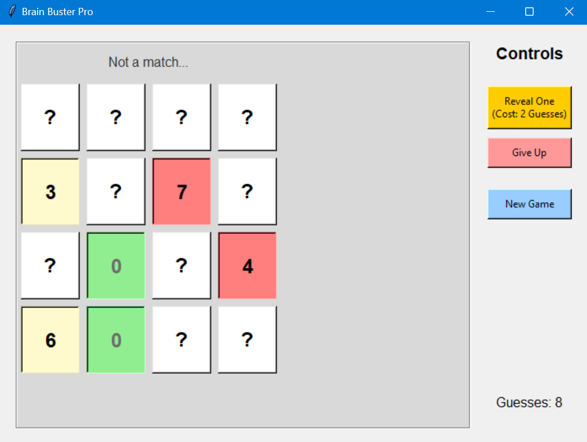
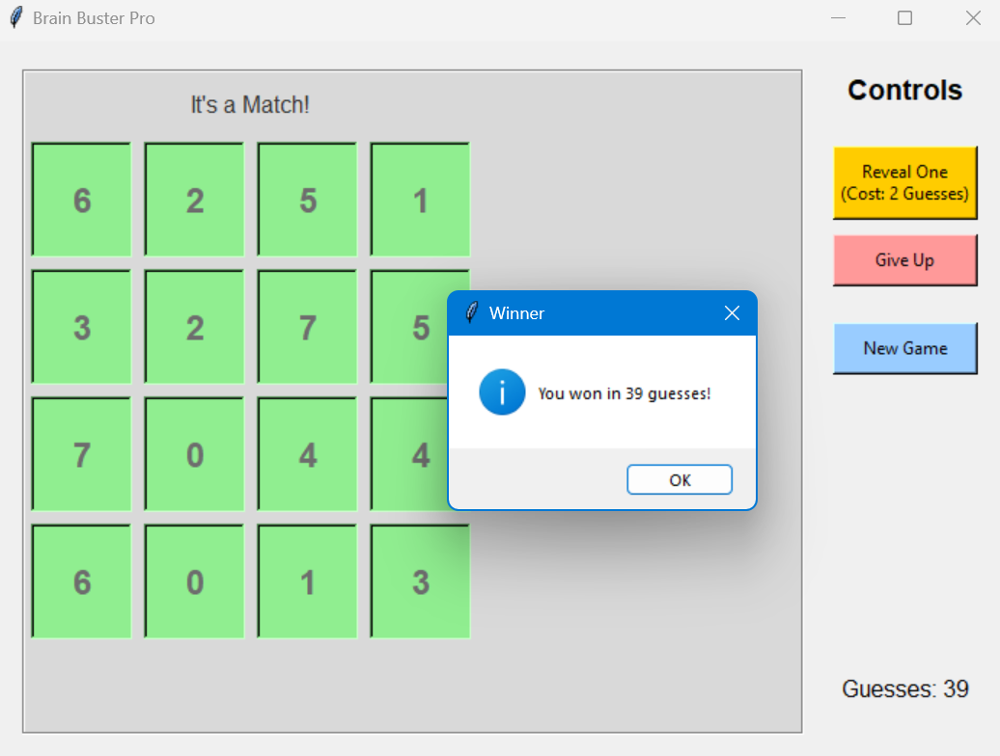
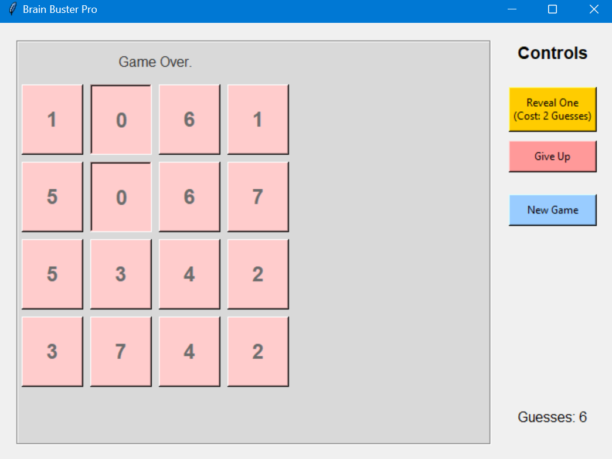

# 🧠 Brain Buster - Python Memory Game




**Brain Buster** is a classic memory matching game built with Python and Tkinter. It features a clean graphical user interface (GUI), a move counter, and special "cheat" mechanics to help you solve the puzzle.

## 🚀 Features

* **GUI Interface:** Fully interactive window with clickable cards.
* **Visual Feedback:**
    * **Green:** Match found!
    * **Red:** Mismatch (try again).
    * **Yellow:** Hint revealed.
* **Score Tracking:** Tracks the number of guesses you make to find all pairs.
* **Game Controls:**
    * **Reveal One:** Spend 2 guesses to permanently reveal a random hidden card.
    * **Give Up:** Reveals the entire grid if you get stuck.
    * **New Game:** Instantly resets the board with a new shuffled grid.

## 🛠️ Installation & Setup

You need **Python 3.x** installed on your computer. Tkinter is included with standard Python installations.

1.  **Clone the repository:**
    ```bash
    git clone [https://github.com/YOUR_USERNAME/BrainBuster.git](https://github.com/YOUR_USERNAME/BrainBuster.git)
    cd BrainBuster
    ```

2.  **Run the game:**
    ```bash
    python game.py
    ```

## 🎮 How to Play

1.  **Start:** The game begins with a 4x4 grid of hidden cards (indicated by `?`).
2.  **Match:** Click on any two cards to reveal their numbers.
    * If the numbers match, they stay visible.
    * If they don't match, they will hide again after 1 second.
3.  **Win:** The game ends when all pairs are found. A popup will show your total guess count.

### Controls Panel
* **Reveal One (Cost: 2 Guesses):** If you are stuck, click this button. One random card will turn **Yellow**. It stays visible, and you can click it later to pair it with its match.
* **Give Up:** Shows the entire board and ends the current game.
* **New Game:** Resets the board and shuffle the numbers.

## 📂 Project Structure

This project follows the **MVC (Model-View-Controller)** design pattern to keep code clean and organized.

* `grid.py`: **(The Model)** Contains the pure game logic. It handles the grid generation, shuffling, and checking for matches. It knows nothing about the GUI.
* `gui_game.py`: **(The View & Controller)** Handles the Tkinter window, buttons, colors, and user inputs. It connects the user's clicks to the logic in `grid.py`.

## 📸 Screenshots

**Victory State**
The game tracks your efficiency and notifies you when you've found all pairs.


**Give Up Feature**
If you get stuck, you can reveal the entire grid (shown in red) to see what you missed.


## 📝 License

This project is open source and free to use.
